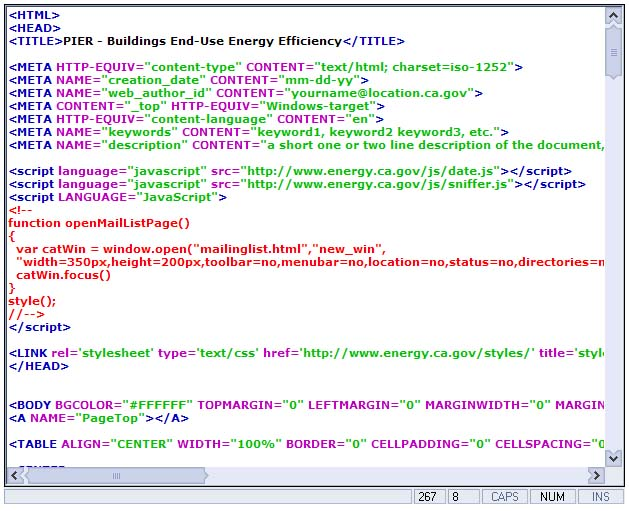



## HTML Syntax Highlighter Control

### Description

I created this control because there are a few good html syntax highlighting programs on PSC but none of the good ones are controls that are easiy put into one's program. This control supports basic highlighting, undo and redo, ability to change the font, fast copy and paste routines.

I have use code from the following projects on PSC to make this and would like to give them credit:

EzColorCode - Html Syntax Highlighting

by Eric Banker

SuperFastHTML-XML Highlighting

by RegX
 
### More Info
 
When changing fonts from your main program first set the font attributes then run the sub procedure called SetNewFontInfo()

I have had a lot of trouble with Coloring comments on the fly so if you enclode any code that was not previously commented out hit f5 to refresh the richtextbox and it should then be colored correctly.

             |
---                |---
**Submitted On**   |2002-08-20 18:15:04
**By**             |[Adam Ruggles](https://github.com/Planet-Source-Code/PSCIndex/blob/master/ByAuthor/adam-ruggles.md)
**Level**          |Advanced
**User Rating**    |4.8 (105 globes from 22 users)
**Compatibility**  |VB 6\.0
**Category**       |[Internet/ HTML](https://github.com/Planet-Source-Code/PSCIndex/blob/master/ByCategory/internet-html__1-34.md)
**World**          |[Visual Basic](https://github.com/Planet-Source-Code/PSCIndex/blob/master/ByWorld/visual-basic.md)
**Archive File**   |[HTML\_Synta1204848202002\.zip](https://github.com/Planet-Source-Code/adam-ruggles-html-syntax-highlighter-control__1-38134/archive/master.zip)

